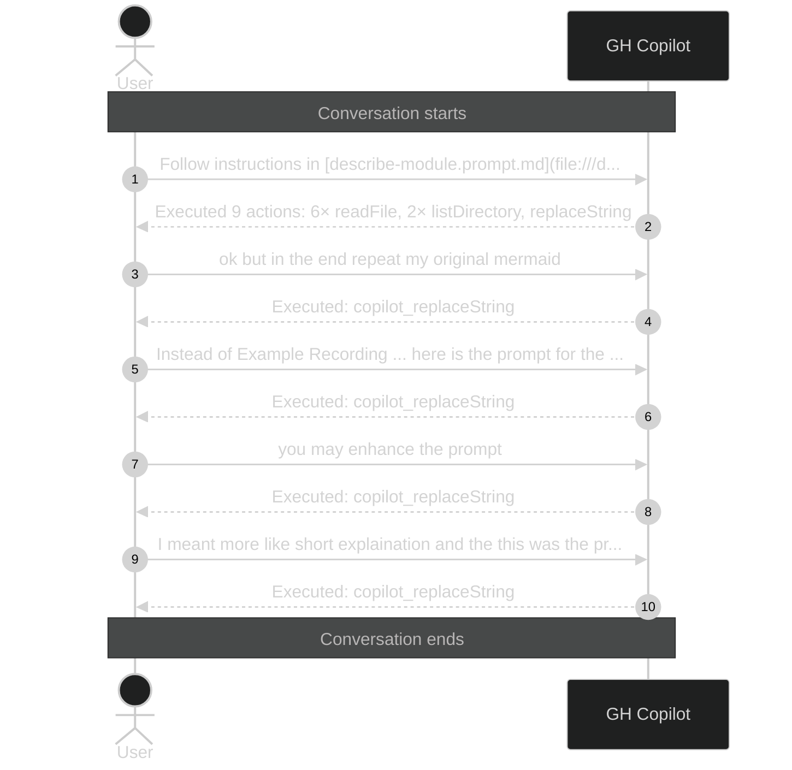

# Copilot Conversation Visualization

Logs and visualizes GitHub Copilot conversations using event hooks.



## Manual Visualization

```powershell
cd .copilot-conversation
npm run visualize              # all sessions → conversations/ (level 1)
npm run visualize -- {id}      # specific session → conversations/ (level 2)
npm run visualize -- {id} 1    # specific session at level 1 (user prompts only)
npm run visualize -- {id} 1 2  # specific session at both levels
```

## Structure

```
.copilot-conversation/
├── data/
│   ├── history-{id}.json
│   ├── tools-{id}.json
│   ├── conv-{id}.json
│   └── debug-{id}.log
├── conversations/   
│   └── conv-{id}.md
├── scripts/         
│   ├── consolidate.mjs
│   ├── visualize.mjs
│   ├── test.mjs
│   └── *hook_scripts*.ps1        
└── package.json
```

## Hook Flow

1. **sessionStart** — generates sessionId, creates `history-` and `tools-` JSON files
2. **userPromptSubmitted** — appends user prompt to `history-{sessionId}.json`
3. **preToolUse** — appends pre-call entry to `tools-{sessionId}.json`
4. **postToolUse** — appends post-call entry with result to `tools-{sessionId}.json`
5. **subagentStarted/Stopped** — creates/updates `agents-{name}-{sessionId}.json`
6. **sessionEnd** — finalizes history, runs `scripts/visualize.mjs`, generates `conversations/conv-{sessionId}.md`

## Testing

```powershell
cd .copilot-conversation
npm test
```
