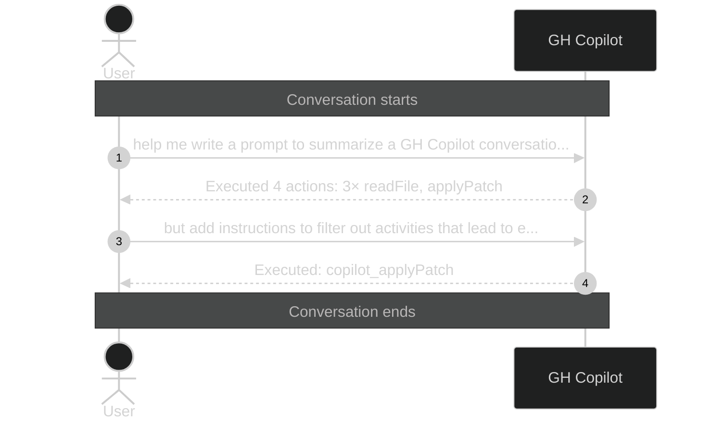

# Executed 5 actions: 3× readFile, 2×

_Session ID: 1fa6a427-02a8-461b-ba6d-623bc13019f7_

**Started:** 2026-02-09T09:01:15.656Z
**Status:** active

## Sequence Diagram

> Level 1: User prompts with Copilot action summaries

---
_Level: 1_
