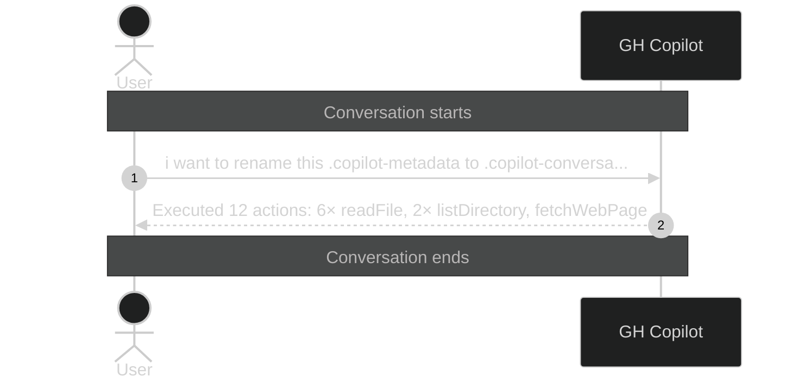

# Executed 12 actions: 6× readFile, 2×

_Session ID: 3704a7c6-553c-461b-a217-c4fb1a779ba7_

**Started:** 2026-02-08T19:23:30.378Z
**Status:** active

## Sequence Diagram

> Level 1: User prompts with Copilot action summaries

---
_Level: 1_
