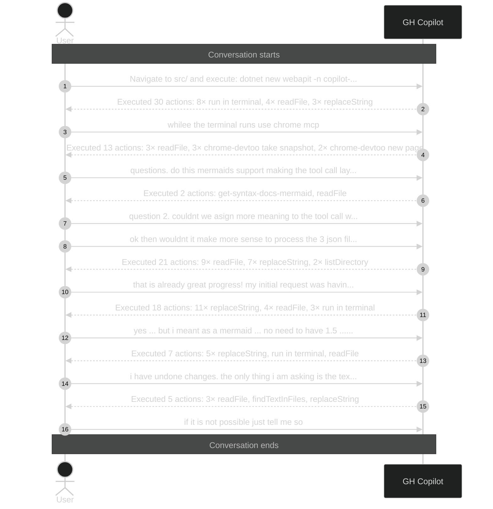

# Executed 96 actions: 27× replaceString, 25×

_Session ID: 3e9cac0d-f20b-4a3b-9804-ca2c2a7bf7fc_

**Started:** 2026-02-08T18:46:37.414Z
**Status:** active

## Sequence Diagram

> Level 1: User prompts with Copilot action summaries

---
_Level: 1_
