# Conversation: 51e4aa23-8eb1-410a-9daf-d7ff9223ddda

**Started:** 2026-02-08T21:03:13.050Z
**Status:** active

## Sequence Diagram

```mermaid
%%{init: {'theme':'dark', 'themeVariables': {'primaryTextColor':'#ffff00', 'primaryBorderColor':'#ffff00', 'textColor':'#ffff00'}}}%%
sequenceDiagram
    autonumber
    actor User as User
    participant Bot as GH Copilot

    Note over User,Bot: Conversation starts

    User->>Bot: make this the only commit in git and github
    Bot-->>User: Executed 8 actions: 7× run in terminal, readFile

    Note over User,Bot: Conversation ends
```

> Level 1: User prompts with Copilot action summaries

---
_Session: 51e4aa23-8eb1-410a-9daf-d7ff9223ddda | Level: 1_
