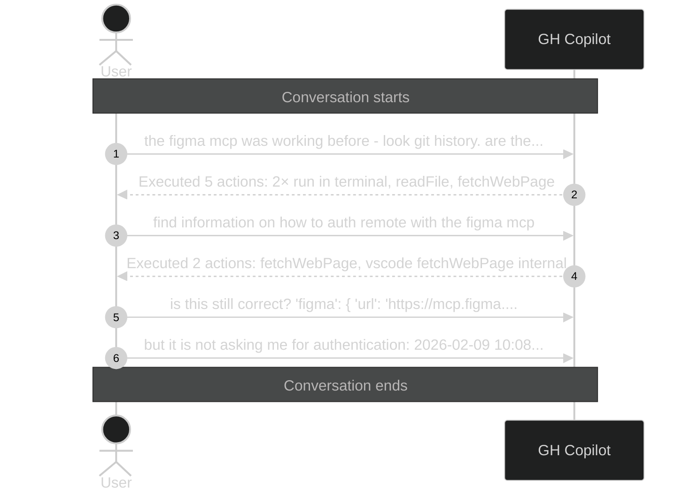

# Executed 7 actions: 2× run in

_Session ID: 69a3d45b-4078-4259-a9ed-9bfb61c70890_

**Started:** 2026-02-09T09:04:51.264Z
**Status:** active

## Sequence Diagram

> Level 1: User prompts with Copilot action summaries

---
_Level: 1_
