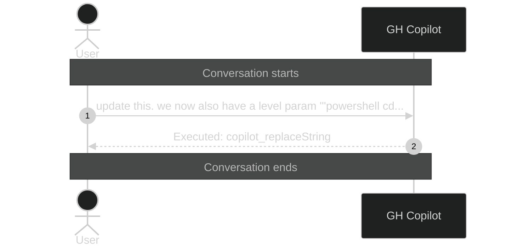

# Conversation: a19c4147-fb13-4445-8527-8e72a2964a20

**Started:** 2026-02-08T21:02:28.250Z
**Status:** active

## Sequence Diagram

> Level 1: User prompts with Copilot action summaries

---
_Session: a19c4147-fb13-4445-8527-8e72a2964a20 | Level: 1_
