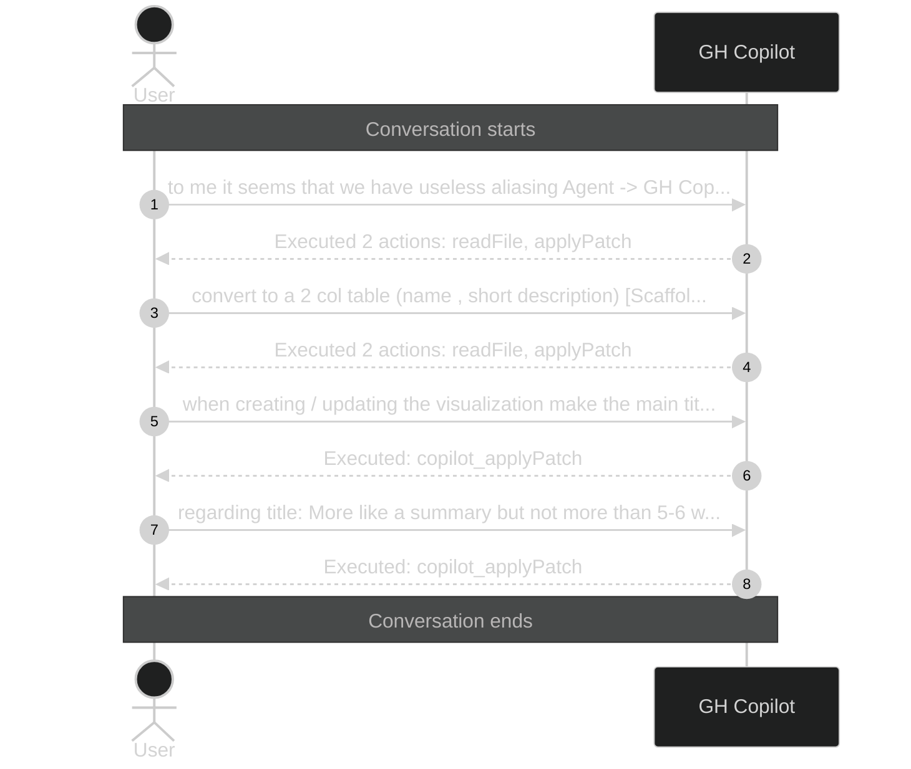

# Executed 6 actions: 4× applyPatch, 2×

_Session ID: a7a2586b-5523-4226-a2d1-018ea338eef5_

**Started:** 2026-02-09T09:18:42.809Z
**Status:** active

## Sequence Diagram

> Level 1: User prompts with Copilot action summaries

---
_Level: 1_
