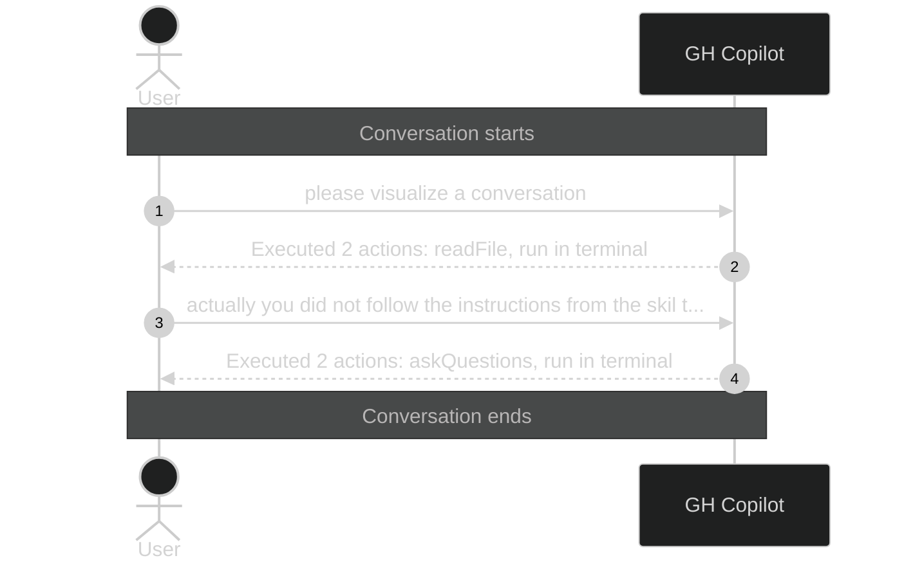

# Executed 4 actions: 2× run in

_Session ID: bb75fae3-7a00-46b9-89b7-6659b0f08517_

**Started:** 2026-02-09T09:30:49.616Z
**Status:** active

## Sequence Diagram

> Level 1: User prompts with Copilot action summaries

---
_Level: 1_
