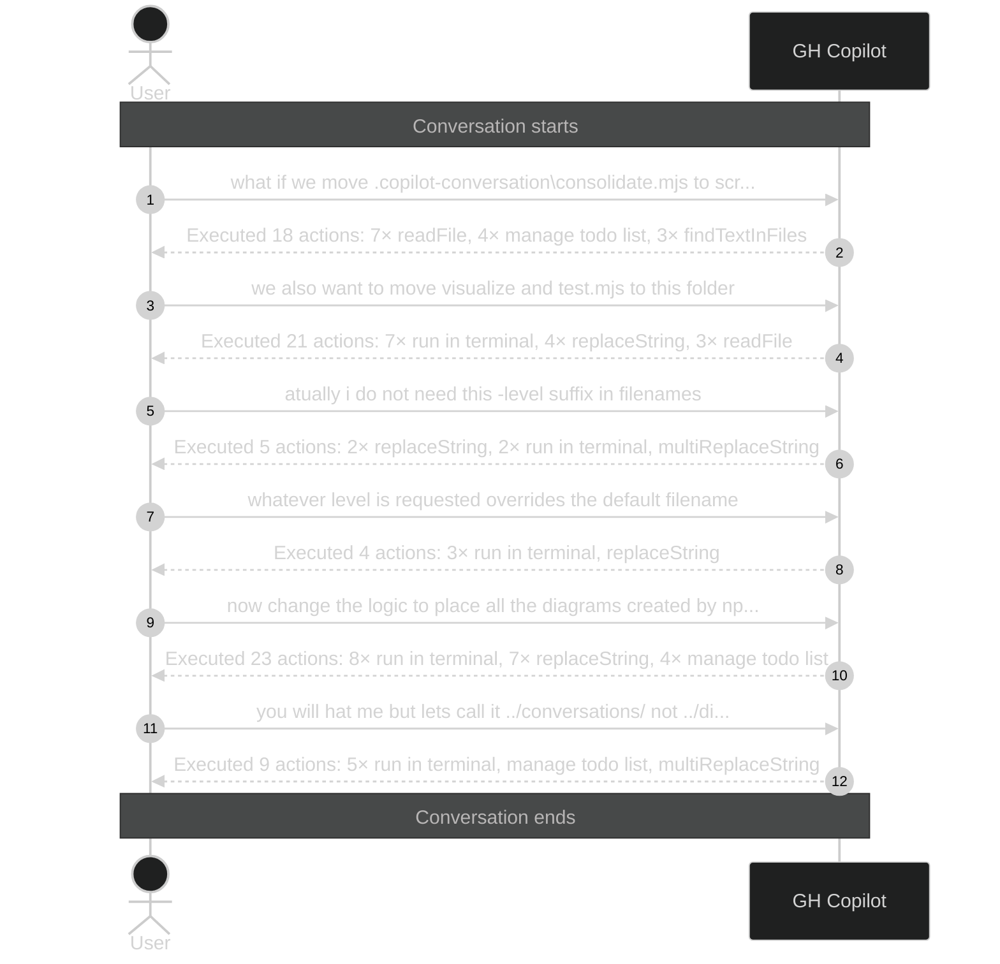

# Conversation: c27a1181-0154-4bfd-a43e-48680328851c

**Started:** 2026-02-08T20:46:40.591Z
**Status:** active

## Sequence Diagram

> Level 1: User prompts with Copilot action summaries

---
_Session: c27a1181-0154-4bfd-a43e-48680328851c | Level: 1_
