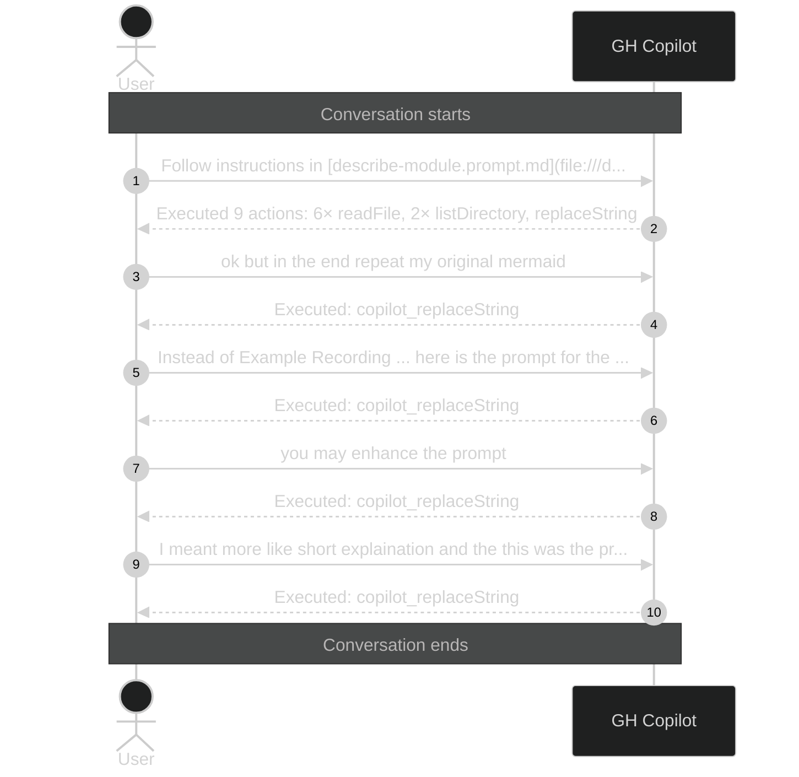

# Conversation: dd9eb250-a034-45d1-858e-57cd51af9006

**Started:** 2026-02-08T19:27:49.426Z
**Status:** active

## Sequence Diagram

> Level 1: User prompts with Copilot action summaries

---
_Session: dd9eb250-a034-45d1-858e-57cd51af9006 | Level: 1_
