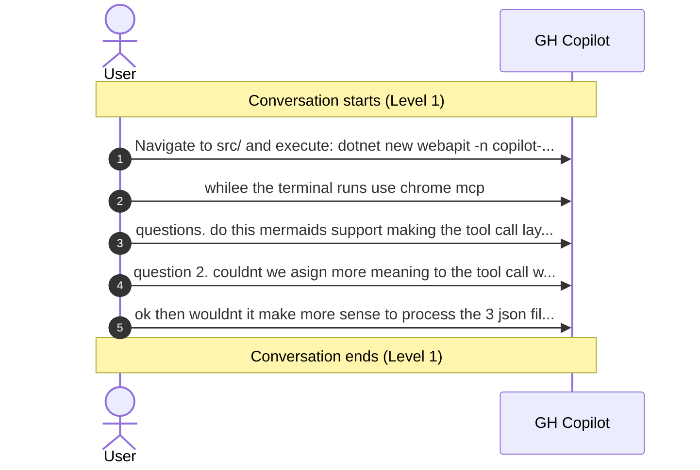

# Conversation: 3e9cac0d-f20b-4a3b-9804-ca2c2a7bf7fc

**Started:** 2026-02-08T18:46:37.414Z
**Status:** active
**Visualization Level:** 1

## Sequence Diagram

## Note
Level 1 shows user-agent conversation flow only. Use level 2 to see tool calls with extended info.

---
_Session: 3e9cac0d-f20b-4a3b-9804-ca2c2a7bf7fc | Level: 1_
