# Conversation: 3e9cac0d-f20b-4a3b-9804-ca2c2a7bf7fc

**Started:** 2026-02-08T18:46:37.414Z
**Status:** active

## Sequence Diagram

```mermaid
sequenceDiagram
    autonumber
    actor User as User
    participant Bot as GH Copilot
    participant API as Tool Use

    Note over User,Bot: Conversation starts

    User->>Bot: Navigate to src/ and execute: dotnet new webapit -n copilot-...

    Bot->>+API: copilot_readFile
    Bot->>+API: manage_todo_list
    Bot->>+API: run_in_terminal
    Bot->>+API: run_in_terminal
    Bot->>+API: copilot_listDirectory
    Bot->>+API: copilot_listDirectory
    Bot->>+API: copilot_readFile
    Bot->>+API: copilot_replaceString
    Bot->>+API: run_in_terminal
    Bot->>+API: copilot_createDirectory
    Bot->>+API: copilot_createDirectory
    Bot->>+API: copilot_createFile
    Bot->>+API: copilot_createFile
    Bot->>+API: copilot_replaceString
    Bot->>+API: run_in_terminal
    Bot->>+API: copilot_replaceString
    Bot->>+API: run_in_terminal
    Bot->>+API: manage_todo_list
    Bot->>+API: run_in_terminal
    Bot->>+API: kill_terminal
    Bot->>+API: run_in_terminal
    Bot->>+API: await_terminal
    Bot->>+API: get_terminal_output
    Bot->>+API: kill_terminal
    Bot->>+API: run_in_terminal
    Bot->>+API: await_terminal
    Bot->>+API: get_terminal_output
    Bot->>+API: kill_terminal
    Bot->>+API: copilot_readFile
    Bot->>+API: copilot_readFile
    API-->>-Bot: OK

    API-->>-Bot: OK

    API-->>-Bot: OK

    API-->>-Bot: OK

    API-->>-Bot: OK

    API-->>-Bot: OK

    API-->>-Bot: OK

    API-->>-Bot: OK

    API-->>-Bot: OK

    API-->>-Bot: OK

    API-->>-Bot: OK

    API-->>-Bot: OK

    API-->>-Bot: OK

    API-->>-Bot: OK

    API-->>-Bot: OK

    API-->>-Bot: OK

    API-->>-Bot: OK

    API-->>-Bot: OK

    API-->>-Bot: OK

    API-->>-Bot: OK

    API-->>-Bot: OK

    API-->>-Bot: OK

    API-->>-Bot: OK

    API-->>-Bot: OK

    API-->>-Bot: OK

    API-->>-Bot: OK

    API-->>-Bot: OK

    API-->>-Bot: OK

    API-->>-Bot: OK

    API-->>-Bot: OK

    User->>Bot: whilee the terminal runs use chrome mcp

    Bot->>+API: run_in_terminal
    Bot->>+API: await_terminal
    Bot->>+API: mcp_chrome-devtoo_new_page
    Bot->>+API: copilot_readFile
    Bot->>+API: copilot_listDirectory
    Bot->>+API: copilot_readFile
    Bot->>+API: mcp_chrome-devtoo_new_page
    Bot->>+API: mcp_chrome-devtoo_take_snapshot
    Bot->>+API: copilot_readFile
    Bot->>+API: mcp_chrome-devtoo_take_snapshot
    Bot->>+API: mcp_chrome-devtoo_navigate_page
    Bot->>+API: mcp_chrome-devtoo_take_snapshot
    Bot->>+API: mcp_chrome-devtoo_click
    API-->>-Bot: OK

    API-->>-Bot: OK

    API-->>-Bot: OK

    API-->>-Bot: OK

    API-->>-Bot: OK

    API-->>-Bot: OK

    API-->>-Bot: OK

    API-->>-Bot: OK

    API-->>-Bot: OK

    API-->>-Bot: OK

    API-->>-Bot: OK

    API-->>-Bot: OK

    API-->>-Bot: OK

    Note over User,Bot: Conversation ends
```

## Metrics

| Metric | Value |
|--------|-------|
| Total Tool Calls | 43 |
| Successful | 0 |
| Failed | 0 |

### Tools Used

| Tool | Calls |
|------|-------|
| copilot_readFile | 7 |
| manage_todo_list | 2 |
| run_in_terminal | 9 |
| copilot_listDirectory | 3 |
| copilot_replaceString | 3 |
| copilot_createDirectory | 2 |
| copilot_createFile | 2 |
| kill_terminal | 3 |
| await_terminal | 3 |
| get_terminal_output | 2 |
| mcp_chrome-devtoo_new_page | 2 |
| mcp_chrome-devtoo_take_snapshot | 3 |
| mcp_chrome-devtoo_navigate_page | 1 |
| mcp_chrome-devtoo_click | 1 |

---
_Session: 3e9cac0d-f20b-4a3b-9804-ca2c2a7bf7fc_
