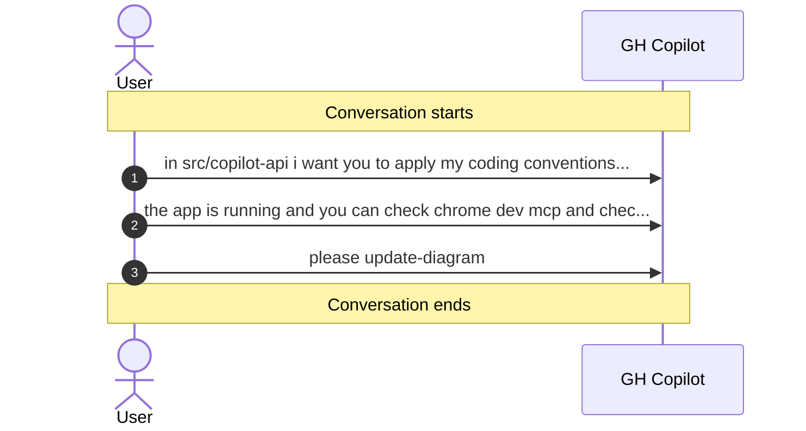

# Conversation: b37b6fc0-b04a-428f-8d42-0116d6b6e7a1

**Started:** [object Object]
**Status:** active

## Sequence Diagram

## Metrics

| Metric | Value |
|--------|-------|
| Total Tool Calls | 0 |
| Successful | 0 |
| Failed | 0 |

---
_Session: b37b6fc0-b04a-428f-8d42-0116d6b6e7a1_
