# Conversation: f851ddc1-fd22-4999-8725-1853d73ed013

**Started:** 2026-02-08T15:48:29.309Z
**Status:** active

## Sequence Diagram

```mermaid
sequenceDiagram
    autonumber
    actor User as User
    participant Bot as GH Copilot
    participant API as Tool Use

    Note over User,Bot: Conversation starts

    User->>Bot: in src/copilot-api i want you to apply my coding conventions...

    Bot->>+API: Tool Call #0
    Bot->>+API: Tool Call #1
    Bot->>+API: Tool Call #2
    Bot->>+API: Tool Call #3
    Bot->>+API: Tool Call #4
    Bot->>+API: Tool Call #5
    Bot->>+API: Tool Call #6
    Bot->>+API: Tool Call #7
    Bot->>+API: Tool Call #8
    Bot->>+API: Tool Call #9
    Bot->>+API: Tool Call #10
    Bot->>+API: Tool Call #11
    Bot->>+API: Tool Call #12
    Bot->>+API: Tool Call #13
    Bot->>+API: Tool Call #14
    Bot->>+API: Tool Call #15
    Bot->>+API: Tool Call #16
    Bot->>+API: Tool Call #17
    Bot->>+API: Tool Call #18
    Bot->>+API: Tool Call #19
    Bot->>+API: Tool Call #20
    Bot->>+API: Tool Call #21
    Bot->>+API: Tool Call #22
    Bot->>+API: Tool Call #23
    API-->>-Bot: OK

    API-->>-Bot: OK

    API-->>-Bot: OK

    API-->>-Bot: OK

    API-->>-Bot: OK

    API-->>-Bot: OK

    API-->>-Bot: OK

    API-->>-Bot: OK

    API-->>-Bot: OK

    API-->>-Bot: OK

    API-->>-Bot: OK

    API-->>-Bot: OK

    API-->>-Bot: OK

    API-->>-Bot: OK

    API-->>-Bot: OK

    API-->>-Bot: OK

    API-->>-Bot: OK

    API-->>-Bot: OK

    API-->>-Bot: OK

    API-->>-Bot: OK

    API-->>-Bot: OK

    API-->>-Bot: OK

    API-->>-Bot: OK

    API-->>-Bot: OK

    User->>Bot: visualize diagram

    Bot->>+API: Tool Call #24
    Bot->>+API: Tool Call #25
    API-->>-Bot: OK

    API-->>-Bot: OK

    User->>Bot: call visualize with session id f851ddc1-fd22-4999-8725-1853d...

    Bot->>+API: Tool Call #26
    Bot->>+API: Tool Call #27
    API-->>-Bot: OK

    API-->>-Bot: OK

    User->>Bot: there is still the issue that responses and toll calls are n...

    Bot->>+API: Tool Call #28
    Bot->>+API: Tool Call #29
    Bot->>+API: Tool Call #30
    Bot->>+API: Tool Call #31
    Bot->>+API: Tool Call #32
    Bot->>+API: Tool Call #33
    Bot->>+API: Tool Call #34
    Bot->>+API: Tool Call #35
    Bot->>+API: Tool Call #36
    Bot->>+API: Tool Call #37
    Bot->>+API: Tool Call #38
    Bot->>+API: Tool Call #39
    API-->>-Bot: OK

    API-->>-Bot: OK

    API-->>-Bot: OK

    API-->>-Bot: OK

    API-->>-Bot: OK

    API-->>-Bot: OK

    API-->>-Bot: OK

    API-->>-Bot: OK

    API-->>-Bot: OK

    API-->>-Bot: OK

    API-->>-Bot: OK

    API-->>-Bot: OK

    Note over User,Bot: Conversation ends
```

## Metrics

| Metric | Value |
|--------|-------|
| Total Tool Calls | 40 |
| Successful | 0 |
| Failed | 0 |

### Tools Used

| Tool | Calls |
|------|-------|
| unknown | 40 |

---
_Session: f851ddc1-fd22-4999-8725-1853d73ed013_
