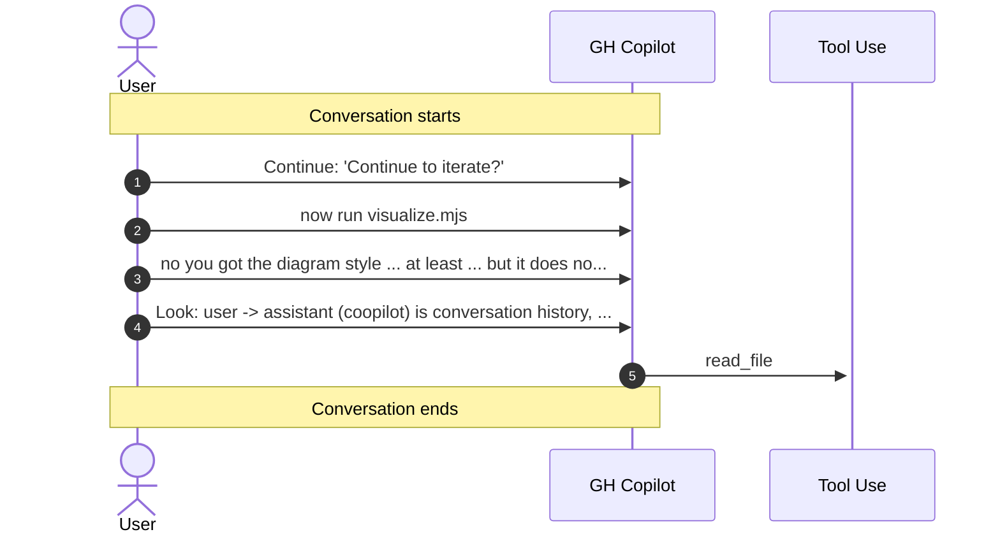

```mermaid
sequenceDiagram
    autonumber
    actor User as User
    participant Bot as GH Copilot
    participant API as Tool Use

    Note over User,Bot: Conversation starts

    User->>Bot: Continue: 'Continue to iterate?'

    User->>Bot: now run visualize.mjs

    User->>Bot: no you got the diagram style ... at least ... but it does no...

    User->>Bot: Look: user -> assistant (coopilot) is conversation history, ...

    Bot->>+API: read_file
    Note over User,Bot: Conversation ends
```
