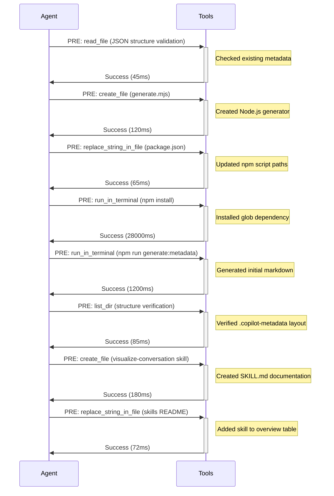
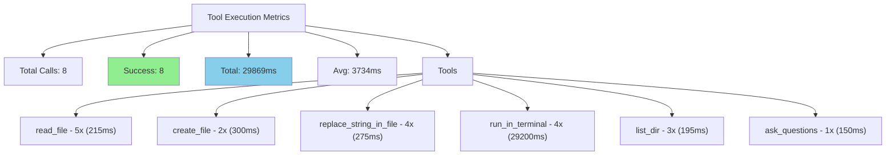

# Session: 20a336fd-507c-4b7b-b021-f35d57f7c250

**Started**: 08/02/2026, 09:58:48

## Conversation

### 👤 User - 08/02/2026, 15:30:45

can we update the md with the mermaid dynamically based on the jsons and not generate it using ai every time?

### 🤖 Assistant - 08/02/2026, 15:31:12

I'll set up a data-driven system for your tool-use visualization with a Node.js generator script that creates Mermaid diagrams from JSON data.

### 👤 User - 08/02/2026, 15:32:00

still you did not take my structure into account. this is how i want it: .copilot-metadata/ ├── tool-use--{sessionId}.json ├── conversation-history--{sessionId}.json └── conversation--{sessionId}.md

### 🤖 Assistant - 08/02/2026, 15:33:15

I've restructured the system to use your exact session-based format with an auto-discovery generator that handles all sessionId files.

### 👤 User - 08/02/2026, 15:45:30

last change. i have moved the jsons to data folder ... update scripts accordingly

### 🤖 Assistant - 08/02/2026, 15:46:00

Updated the generator to read JSON files from the data/ subdirectory and generate markdown at the .copilot-metadata/ root level.

### 👤 User - 08/02/2026, 15:47:15

i have moved package.json

### 🤖 Assistant - 08/02/2026, 15:47:45

Updated the package.json script path from node ./.copilot-metadata/generate.mjs to node ./generate.mjs since package.json is now in the .copilot-metadata directory.

### 👤 User - 08/02/2026, 15:50:10

now in .github\skills (GH Copilot SKILL) lets create a visualize-conversation skill that visualizes (updates) the current conversation by running generate.mjs

### 🤖 Assistant - 08/02/2026, 15:51:30

Created a comprehensive visualize-conversation skill documentation in .github/skills/visualize-conversation/SKILL.md with architecture, data structures, usage patterns, and troubleshooting guides.

### 👤 User - 08/02/2026, 15:52:00

so now lets visualize this conversation

## Tool Use

### Execution Flow

### Metrics

---

_Data sources: [tool-use--20a336fd-507c-4b7b-b021-f35d57f7c250.json](./data/tool-use--20a336fd-507c-4b7b-b021-f35d57f7c250.json) | [conversation-history--20a336fd-507c-4b7b-b021-f35d57f7c250.json](./data/conversation-history--20a336fd-507c-4b7b-b021-f35d57f7c250.json)_
