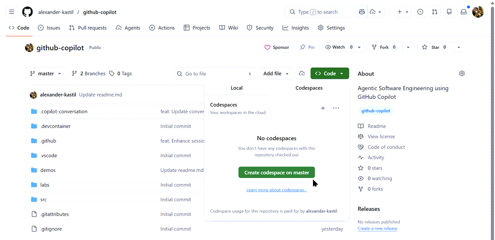

# GitHub Codespaces / Dev Containers

Standardize development environments and enable instant, cloud-based coding. Dev Containers are Docker-based configurations stored in your repository that define consistent development environments, while GitHub Codespaces automatically uses these configurations to spin up pre-configured cloud environments in seconds. You can start coding immediately in your browser or VS Code without any local setup—just click a button and your full development environment is ready.



## Dev Containers

Docker-based local development environments defined in your repository, ensuring every developer has identical tooling and dependencies. Dev Containers are typically Linux-based, with many official base images available including Python, Node.js, .NET, and language-specific stacks, enabling flexible configuration for any development need. Works locally or with Codespaces.

Version-controlled configurations eliminate the "works on my machine" problem and simplify onboarding for new contributors. Full customization of tools, extensions, and dependencies makes Dev Containers adaptable to any project.

## GitHub Codespaces

GitHub Codespaces are cloud-hosted development environments that spin up in seconds from any repository branch. Eliminates local setup hassles and allows developers to work from any device. No local tools installation required, with consistent environments across your team that can be accessed from any browser or VS Code.

### Configuration

Codespaces are configured using [devcontainer.json](/.devcontainer/devcontainer.json) which defines the base image, installed features, VS Code extensions, port forwarding, and post-creation commands.

Image specifies the base container image (Python 3.12):

```json
"image": "mcr.microsoft.com/devcontainers/python:3.12"
```

Features adds development tools (.NET 10.0, Node.js 22, Azure CLI, GitHub CLI):

```json
"features": {
  "ghcr.io/devcontainers/features/dotnet:2.4.2": { "version": "10.0" },
  "ghcr.io/devcontainers/features/node:1": { "version": "22" },
  "ghcr.io/devcontainers/features/azure-cli:1": {}
}
```

Customizations configures VS Code extensions and their settings for the environment:

```json
"customizations": {
  "vscode": {
    "extensions": [ ... ],
    "settings": { ... }
  }
}
```

Extensions lists specific VS Code extensions for .NET, Angular, Azure, Python, and general development:

```json
"extensions": [
  "ms-dotnettools.csharp",
  "angular.ng-template",
  "ms-azuretools.vscode-bicep",
  "ms-python.python",
  "github.copilot"
]
```

VS Code settings enables auto-formatting, imports organization, Copilot integration, and terminal auto-approval for common commands:

```json
"settings": {
  "editor.formatOnSave": true,
  "github.copilot.enable": { "*": true }
}
```

## Key Topics Covered in This Section

- [GitHub Codespaces Documentation](https://docs.github.com/en/codespaces/about-codespaces/what-are-codespaces)
- [Dev Containers Documentation](https://code.visualstudio.com/docs/devcontainers/containers)
