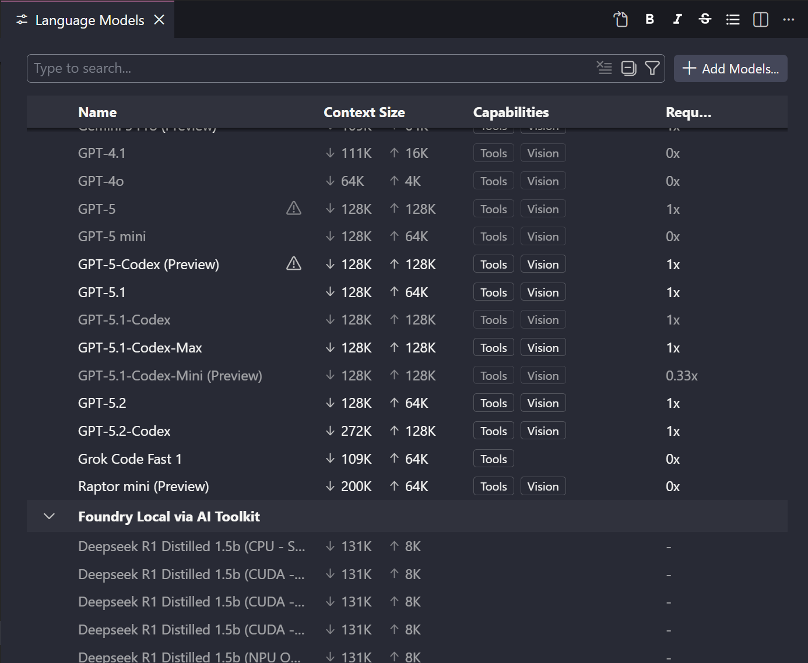

# Models 

GitHub Copilot offers access to multiple language models through the Language Models editor in VS Code, allowing you to select the optimal model for your specific tasks. Each model has distinct characteristics including context window sizes, output capabilities, and performance profiles suited for different coding scenarios.

| Model                | Description                                                                                                                               | Factor |
| -------------------- | ----------------------------------------------------------------------------------------------------------------------------------------- | ------ |
| **Claude Haiku 4.5** | Lightweight and fast. Ideal for quick code completions, refactoring, and explanations with 128K context window.                           | 0.33x  |
| **Claude Opus 4.6**  | Maximum reasoning power for intricate algorithms, system design, and debugging complex codebases. 128K context window.                    | 3x     |
| **Gemini 2.5 Pro**   | Google's latest with 109K context and 64K output. Strong at reasoning tasks, code analysis, and working with large codebases.             | 1x     |
| **GPT-5.2-Codex**    | OpenAI's advanced reasoning model with 272K context. Superior for complex code generation, multi-file analysis, and architectural design. | 1x     |

## Premium Requests

Advanced models consume premium requests from your monthly allocation. The cost multiplier (0.33x, 1x, 3x) determines how many requests are deducted per interaction. Monitor your usage in the model picker where multipliers are displayed alongside each model, and consider using "Auto" mode for a 10% discount while GitHub optimally routes your requests.


The pricing panel shows the cost multiplier for each model, with the Auto mode providing a 10% discount by automatically selecting the most efficient model for your request.

## Model Selection

Choose lightweight models like **Claude Haiku 4.5** (0.33x) for rapid iterations, inline completions, and documentation. Switch to balanced models like **Gemini 2.5 Pro** (1x) for standard development requiring deeper understanding. Reserve premium models like **Claude Opus 4.5** (3x) or **GPT-5.2-Codex** (1x) for complex problem-solving where superior reasoning justifies the higher request cost.

## Foundry and Local Models & Language Models Editor

The [AI Toolkit for Visual Studio Code](https://marketplace.visualstudio.com/items?itemName=ms-windows-ai-studio.windows-ai-studio) extension enables access to both Foundry and Local models directly within VS Code. Foundry models provide cloud-based access to a curated selection of models, while Local models allow you to run models like Deepseek R1 Distilled on your machine for offline development, privacy-sensitive tasks, or experimentation without consuming cloud requests.



The Language Models editor displays all available models with their context window sizes and capabilities, making it easy to compare and select the right model for your task.

**Enable AI Toolkit in VS Code:**

```json
{
  "extensions": [
    "ms-windows-ai-studio.windows-ai-studio"
  ]
}
```

## Key Topics Covered in This Section

- [Language Models in GitHub Copilot](https://docs.github.com/en/copilot/using-github-copilot/asking-github-copilot-questions-in-your-ide#ai-models-for-copilot-chat)
- [AI Toolkit for Visual Studio Code](https://marketplace.visualstudio.com/items?itemName=ms-windows-ai-studio.windows-ai-studio)
- [GitHub Copilot Model Pricing](https://github.com/features/copilot/plans)
