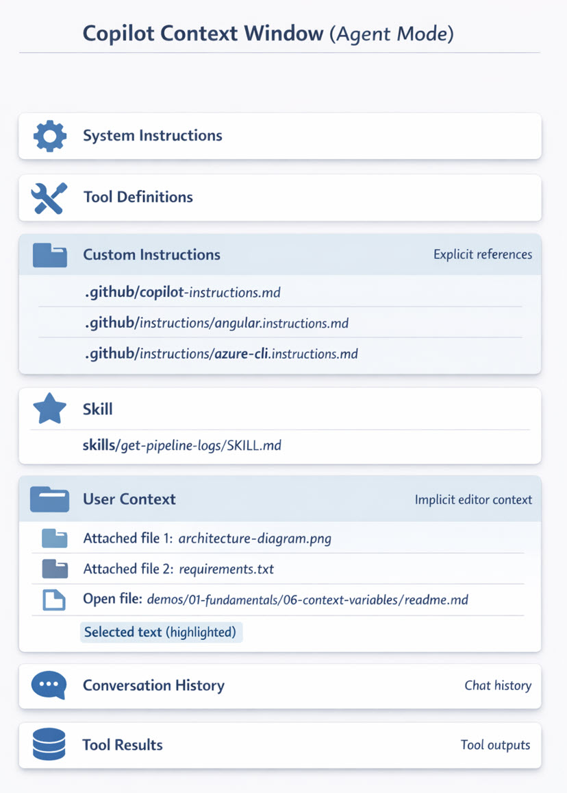

# Context Engineering

Context engineering is the practice of strategically providing information to GitHub Copilot to improve the quality, accuracy, and relevance of its responses. By understanding what goes into GitHub Copilot's context window and deliberately composing that context, you guide GitHub Copilot to produce results that precisely match your project's needs and coding conventions.

## How Context Flows to GitHub Copilot

GitHub Copilot builds its understanding from multiple context sources working together. Your Context Window indicates how much of your available token budget you are using—for example, 41K of 272K tokens (15%) gives you substantial room to add more context.


Effective context includes system instructions, custom instructions that direct your project's patterns, skills available in the session, and user context (open files, selections, references). The orchestration of these layers is what makes context engineering powerful.

When you reference files with the file context button, add relevant instructions, or attach examples, you are deliberately shaping how GitHub Copilot understands the task. Smart context engineering reduces iteration time, minimizes off-topic suggestions, and helps maintain code quality and consistency across your project.



The GitHub Copilot Context Window (Agent Mode) diagram above shows all the components working together: System Instructions and Tool Definitions form the foundation, Custom Instructions provide explicit references to files that define your project rules, Skills add specialized capabilities, and User Context (including attached files, open files, and highlighted selections) supply the immediate problem context. Conversation History carries forward previous exchanges. This layered approach means GitHub Copilot has a complete picture of what you are trying to build.

### Why Smart Context Engineering Leads to Better Results

When GitHub Copilot has the right context, it understands not just what you want to build, but how you build it. System instructions, custom instructions, and user context together give it your naming conventions, patterns, and immediate task details.

The result is responses that match your codebase style, use your preferred libraries, and follow your architectural patterns without extra iterations. Without smart context, GitHub Copilot must guess at conventions. With it, GitHub Copilot has a complete picture and produces first-draft results that often need little or no revision.

### Enable Instructions Files for Context

Ensure GitHub Copilot automatically reads your project instructions by configuring VS Code settings:

```json
{
  "chat.instructionsFilesLocations": {
    ".github/instructions": true,
    ".github/copilot-instructions.md": true
  }
}
```

This enables GitHub Copilot to load language-specific and project-wide instructions without manual file references, making context engineering automatic and consistent across your team.

## Links & Resources

- [Context Engineering Guide](https://code.visualstudio.com/docs/copilot/guides/context-engineering-guide)
