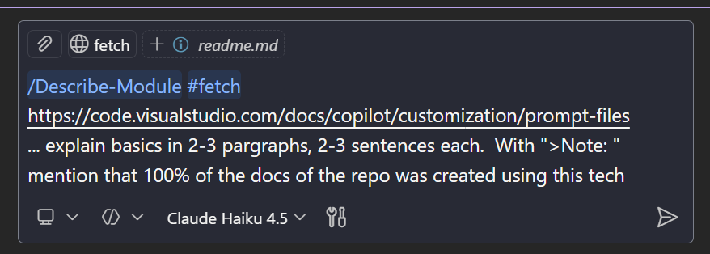

# Prompt Files

## What Are Prompt Files?

Prompt files are Markdown documents (`.prompt.md` extension) that define reusable, on-demand prompts for common development tasks like generating code, performing code reviews, documenting modules, or scaffolding project components. They live in your workspace under `.github/prompts/` or in your user profile, making them available whenever you need to run a standardized workflow. Unlike custom instructions that apply to all requests, prompt files are triggered explicitly by typing `/` followed by the prompt name in the chat input.

Prompt files combine structured metadata with task-specific instructions, allowing you to encapsulate complex guidelines and ensure consistent execution across your team. You can configure them with specific agents, tools, models, and even reference other files in your workspace. This makes them powerful for creating a library of standardized development workflows that scale across your entire organization.

## Enable Prompt Files

Ensure Copilot Chat is enabled and prompt discovery is active:

```json
{
  "chat.agent.enabled": true,
  "chat.detectParticipant.enabled": true,
  "github.copilot.chat.customAgents.showOrganizationAndEnterpriseAgents": true
}
```


> **Note:** 100% of the documentation in this repository was created using prompt files. They enable consistent, high-quality documentation across demos, modules, and infrastructure code without manual effort.



## Prompt Files in This Repository

| Prompt Name                                                        | Description                                                                                                                                                                                           |
| ------------------------------------------------------------------ | ----------------------------------------------------------------------------------------------------------------------------------------------------------------------------------------------------- |
| [Describe Module](../../.github/prompts/describe-module.prompt.md) | Enhances markdown documentation by analyzing folder contents and rewriting descriptions with consistent tone and technical details. Used throughout the repo to document modules, labs, and features. |
| [Create Docs](../../.github/prompts/create-docs.prompt.md)         | Generates comprehensive documentation across project levels using a bottom-up approach, from service-level details up to project overviews. Ensures consistency and proper Markdown formatting.       |

## Links & Resources

- [VS Code Prompt Files Documentation](https://code.visualstudio.com/docs/copilot/customization/prompt-files)
- [Awesome Copilot - Community Contributions](https://github.com/github/awesome-copilot)
