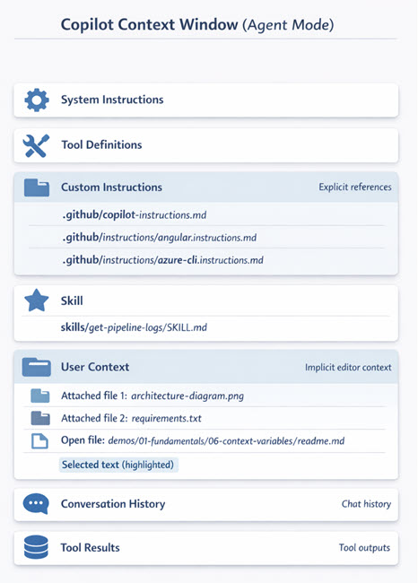

# Understanding and Shaping GitHub Copilot's Context Window

Context engineering is the practice of strategically providing information to GitHub Copilot to improve the quality, accuracy, and relevance of its responses. By understanding what goes into GitHub Copilot's context window and deliberately composing that context, you guide GitHub Copilot to produce results that precisely match your project's needs and coding conventions.

## How Context Flows to GitHub Copilot

GitHub Copilot builds its understanding from multiple context sources working together. Your Context Window shows how much of your available token budget you are using—for example, 41K of 272K tokens (15%) gives you substantial room to add more context.

 Context Window indicator showing token usage.

Effective context includes system instructions, custom instructions that direct your project's patterns, skills available in the session, and user context (open files, selections, references). The orchestration of these layers is what makes context engineering powerful.

### Understanding Model Context Windows

Each GitHub Copilot model has a specific context window size that determines how much information it can process. Claude Haiku 4.5 supports a 200K‑token context window, allowing you to include extensive project context, conversation history, and code samples. Gemini 3 Pro provides up to ~1,000,000 tokens, giving you flexibility to work with larger codebases and more detailed instructions

When context engineering, understanding your model's limits helps you prioritize what information matters most. New users benefit from knowing that a larger context window means you can reference more files, include longer instructions, and maintain richer conversation history without constraints.

When you reference files with the file context button, add relevant instructions, or attach examples, you are deliberately shaping how GitHub Copilot understands the task. Smart context engineering reduces iteration time, minimizes off-topic suggestions, and helps maintain code quality and consistency across your project.

GitHub Copilot Agent Mode Context Window showing all component layers:

 

The diagram above shows how System Instructions and Tool Definitions form the foundation, Custom Instructions provide explicit references to your project rules, and Skills add specialized capabilities. User Context (attached files, open files, selections) supplies immediate problem details, while Conversation History carries forward previous exchanges.

### Why Smart Context Engineering Leads to Better Results

When GitHub Copilot has the right context, it understands not just what you want to build, but how you build it. System instructions, custom instructions, and user context together provide naming conventions, architectural patterns, and immediate task details without extra explanation needed.

Smart context engineering results in first-draft code that matches your style, uses your preferred libraries, and follows established patterns. Without it, GitHub Copilot must guess at conventions and may produce off-target suggestions that require revision.

### Enable Instructions Files for Context

Ensure GitHub Copilot automatically reads your project instructions by configuring VS Code settings:

```json
{
  "chat.instructionsFilesLocations": {
    ".github/instructions": true,
    ".github/copilot-instructions.md": true
  }
}
```

This enables GitHub Copilot to load language-specific and project-wide instructions without manual file references, making context engineering automatic and consistent across your team.

## Links & Resources

- [Context Engineering Guide](https://code.visualstudio.com/docs/copilot/guides/context-engineering-guide)
