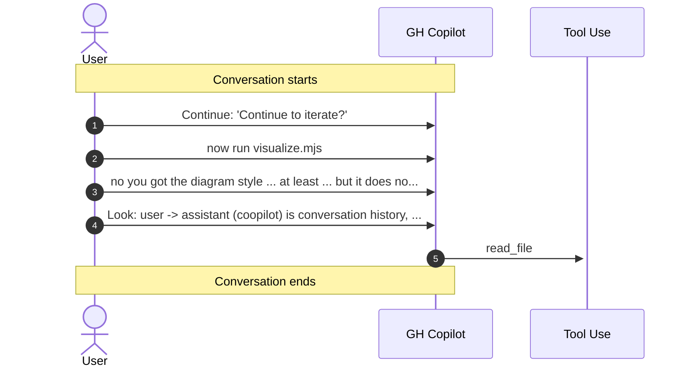

# GitHub Copilot Hooks

GitHub Copilot hooks allow you to extend and customize agent behavior by executing custom shell commands at key points during agent execution. Hooks run in response to specific events in the agent lifecycle, enabling you to implement logging, validation, notifications, and custom integrations without modifying the agent code.

>Note: As of 08 Feb 2026 hooks are only available in [VS Code Insiders](https://code.visualstudio.com/insiders/).

## Hook Types

| Hook | Trigger | Description |
|------|---------|-------------|
| Session Start | When a new agent session begins or when resuming an existing session | Execute initialization logic, setup logging, or prepare your environment before the agent starts |
| User Prompt Submit | When the user submits a prompt to the agent | Log user requests, validate input, or perform pre-processing before the agent processes the prompt |
| Pre-Tool Use | Before the agent uses any tool | Validate tool parameters, log tool invocations, or conditionally block tool execution |
| Post-Tool Use | After a tool completes execution successfully | Log results, update metrics, trigger notifications, or perform cleanup operations |
| Subagent Start | When a subagent is started | Track subagent lifecycle and manage resources |
| Subagent Stop | When a subagent stops | Log subagent completion or clean up state |
| Stop | When the agent stops | Finalize logs, clean up resources, or trigger completion workflows |

## Use Cases

- Audit and Monitoring: Log all agent activities with timestamps, user information, and executed actions for compliance and debugging.
- Custom Validations: Validate tool parameters before execution or enforce security policies before the agent proceeds.
- Integration: Trigger external systems, send notifications to Slack or email, or integrate with CI/CD pipelines based on agent events.
- Performance Tracking: Measure execution time, monitor tool usage, and collect metrics for optimization.
- Conditional Execution: Block dangerous operations or prevent tools from running in certain contexts using hook validation.

## Getting Started

Create a hooks.json file in the `.github/hooks/` directory (or current working directory for Copilot CLI) with your desired hook configurations:

```json
{
	"version": 1,
	"hooks": {
		"sessionStart": [
			{
				"type": "command",
				"powershell": ".\\init-conversation.ps1",
				"cwd": ".github/hooks",
				"timeoutSec": 5
			}
		],
		"userPromptSubmitted": [
			{
				"type": "command",
				"powershell": ".\\log-prompt.ps1",
				"cwd": ".github/hooks",
				"timeoutSec": 10
			}
		],
		"preToolUse": [
			{
				"type": "command",
				"powershell": ".\\track-tool-use.ps1 -Phase pre",
				"cwd": ".github/hooks",
				"timeoutSec": 10
			}
		],
		"postToolUse": [
			{
				"type": "command",
				"powershell": ".\\track-tool-use.ps1 -Phase post",
				"cwd": ".github/hooks",
				"timeoutSec": 10
			}
		],
		"sessionEnd": [
			{
				"type": "command",
				"powershell": ".\\finalize-conversation.ps1",
				"cwd": ".github/hooks",
				"timeoutSec": 5
			}
		]
	}
}
```



## Links & Resources

- [Using hooks with GitHub Copilot agents](https://docs.github.com/en/copilot/how-tos/use-copilot-agents/coding-agent/use-hooks)
- [Hooks configuration reference](https://docs.github.com/en/copilot/reference/hooks-configuration)
- [About GitHub Copilot hooks](https://docs.github.com/en/copilot/concepts/agents/coding-agent/about-hooks)
- [Customize the development environment for GitHub Copilot coding agent](https://docs.github.com/en/copilot/how-tos/use-copilot-agents/coding-agent/customize-the-agent-environment)