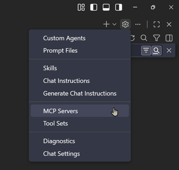

# Model Context Protocol

Model Context Protocol (MCP) is a standardized framework that enables GitHub Copilot to connect to external tools, services, and data sources. It acts as a bridge between Copilot and specialized systems—allowing Copilot to access real-time information, execute commands, and interact with platforms like Azure DevOps, GitHub, or deployment services. MCPs extend Copilot's capabilities beyond code generation to include infrastructure management, testing automation, and domain-specific tooling.



The MCP ecosystem provides both local executables for direct system access and remote HTTP endpoints for cloud services, enabling seamless integration of specialized capabilities into your Copilot workflows.

## Enable MCP Discovery and Auto-Start

Configure VS Code to auto-discover and start MCP servers:

```json
{
  "chat.mcp.discovery.enabled": {
    "claude-desktop": true
  },
  "chat.mcp.autostart": "newAndOutdated",
  "chat.mcp.gallery.enabled": true
}
```

## MCP Server Types & Integration

MCP servers can be integrated in multiple ways depending on their nature: **local executables** (via `npx` or `stdio` commands) and **remote HTTP endpoints** for cloud services. 

You can configure MCPs in the following ways:

- **Global configuration** ([~/.vscode/mcp.json](/.vscode/mcp.json)): Available across all workspaces for persistent access
- **Workspace-level configuration** ([.vscode/mcp.json](/.vscode/mcp.json)): Scoped to the current project to isolate tools for specific needs

MCPs can come from:

- VS Code extensions
- npm packages
- Custom implementations

## MCP Configuration

The [mcp.json](/.vscode/mcp.json) file contains server definitions organized by name, with each server specifying its type (`stdio`, `http`), command/URL, and optional arguments. For sensitive data (API keys, passwords, organization names), MCPs support **input parameters** that prompt for values at runtime and pass them securely via environment or URL variables, preventing hardcoding of credentials.

### Structure Example

```json
{
  "servers": {
    "server-name": {
      "command": "npx",
      "args": ["@package/mcp", "--option=value"],
      "type": "stdio"
    }
  },
  "inputs": [
    {
      "type": "promptString",
      "id": "API_KEY",
      "description": "Your API key",
      "password": true
    }
  ]
}
```

## Common MCPs for Development Workflows

In this class we have [registered](/.vscode/mcp.json) several MCP servers that integrate with popular development tools and platforms. These MCPs enable Copilot to interact with Azure DevOps, GitHub, Microsoft 365, design systems, and remote servers directly from your VS Code environment.

| MCP                 | Type            | Purpose                                                                                                  |
| ------------------- | --------------- | -------------------------------------------------------------------------------------------------------- |
| **Microsoft Learn** | Remote (HTTP)   | Official Microsoft documentation and code samples for Azure, .NET, and Microsoft 365 services.           |
| **Azure DevOps**    | Local (`npx`)   | Programmatic access to Azure DevOps pipelines, repos, work items, and service connections via REST API.  |
| **Azure Deploy**    | Local (`npx`)   | Infrastructure deployment and management for Azure resources with CLI-based orchestration.               |
| **GitHub**          | Remote (HTTP)   | GitHub API integration for repositories, issues, pull requests, and project management.                  |
| **WorkIQ**          | Local (`npx`)   | Microsoft 365 integration for accessing emails, meetings, files, and work context across Microsoft apps. |
| **Figma**           | Remote (HTTP)   | Design system integration for extracting UI components, diagrams, and design metadata.                   |
| **SSH MCP**         | Local (`stdio`) | Remote server management via SSH for infrastructure provisioning, diagnostics, and system configuration. |
| **Playwright**      | Local (`npx`)   | Browser automation with vision support for visual testing and screenshot capture during E2E tests.       |
| **Debug MCP**       | Local (`npx`)   | Debugging and diagnostic capabilities for agents, enabling introspection and issue diagnosis.            |
| **Chrome DevTools** | Local (`npx`)   | Chrome DevTools protocol integration for browser debugging, performance profiling, and DOM inspection.   |

## Key Topics Covered in This Section

- [VS Code MCP Servers Documentation](https://code.visualstudio.com/docs/copilot/customization/mcp-servers)
