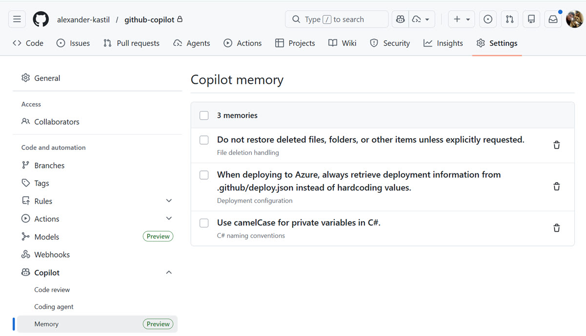

# Copilot Memory

## What is Copilot Memory?

Copilot Memory enables Copilot to build a persistent, repository-specific understanding by storing tightly scoped information about your codebase that it deduces through interactions. Memories are validated against current code citations, automatically deleted after 28 days if unused, and kept completely repository-scoped to ensure privacy and security. This persistent knowledge reduces the burden of repeatedly explaining coding conventions and maintaining custom instruction files, allowing Copilot to adapt to your repository's patterns and deliver increasingly better results over time.

## Enable Copilot Memory

Copilot Memory is turned off by default and must be enabled in VS Code settings:

```json
{
  "github.copilot.chat.copilotMemory.enabled": true
}
```

Currently, Copilot Memory is used by **Copilot coding agent**, **Copilot code review**, and **Copilot CLI** when working on pull requests and code operations on GitHub.

## Use Cases & Examples

Memory ist stored in the settings of your GitHub repository:



### 1. Deployment Configuration Management

When Copilot discovers your repository maintains a [deploy.json](/.github/deploy.json) file as the single source of truth for Azure deployment metadata (service connections, container registries, environments), it stores this as a memory. Later, when scripting deployments or creating pipelines, Copilot automatically retrieves configuration from this file instead of hardcoding values, ensuring consistency across all deployment operations.

```
Memory: "Deployment configuration always sourced from .github/deploy.json"
Citations: Lines 1-10 in .github/deploy.json (defines Azure Service Connection, ACR, ACA environment)
Use: Deployment scripts and pipeline generation automatically read values from deploy.json
```

### 2. Respecting Intentional Deletions

Copilot learns your preferences about file and folder management. When you intentionally delete files, folders, or other items from your workspace, Copilot remembers this preference and respects those deletions rather than automatically restoring or recovering them in future operations. This ensures deleted items remain gone unless you explicitly ask for restoration.

```
Memory: "Do not restore deleted files, folders, or items unless explicitly requested"
Behavior: User deletes unnecessary files or outdated configurations
Use: Copilot avoids suggesting recovery or restoration of intentionally deleted items
```

### 3. C# Private Variable Naming Conventions

Copilot learns your C# coding style preferences. When it observes or is told that your codebase uses camelCase for private variables (e.g., `_userName`, `_connectionString`), Copilot stores this as a memory. Later, when generating new C# classes, refactoring existing code, or reviewing pull requests, Copilot automatically applies this naming convention to all private fields and variables without requiring repeated instructions.

```
Memory: "Use camelCase for private variables in C#"
Pattern: Private fields like _userId, _configSettings, _apiKey
Use: Code generation and refactoring automatically apply camelCase naming to new private members
```

## Key Topics Covered in This Section

- [GitHub Copilot Memory Concepts](https://docs.github.com/en/copilot/concepts/agents/copilot-memory)
- [Enabling and Curating Copilot Memory](https://docs.github.com/en/copilot/how-tos/use-copilot-agents/copilot-memory)
