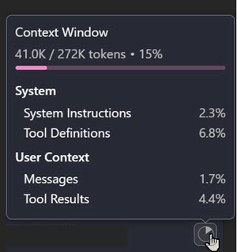

# Understanding and Shaping GitHub Copilot's Context Window

Context engineering is the practice of strategically designing what information GitHub Copilot receives to improve the quality and relevance of its responses. By understanding what fills your context window and deliberately composing it, you guide GitHub Copilot to produce results that match your project's needs, coding conventions, and architectural patterns.

The benefit is immediate and tangible: first-draft code that fits your style, better suggestions aligned with your stack, and reduced iteration cycles. Rather than GitHub Copilot guessing at conventions, smart context engineering ensures it understands how you build.

Your context window is filled by multiple information sources working together:

- System instructions and tool definitions form the foundation
- Custom project instructions direct your patterns
- Available skills add specialized capabilities
- User context (open files, selections, attached references) supplies immediate problem details
- Conversation history (previous messages, code findings, ...)

Understanding what fills each layer helps you leverage the most relevant information for each task.

Context Window indicator showing token usage:

## What Fills Your Context Window

Each GitHub Copilot model has a specific context window size that determines how much information it can process. Claude Haiku 4.5 supports a 200K token context window, allowing you to include extensive project context, conversation history, and code samples. Gemini 3 Pro provides up to approximately 1,000,000 tokens, giving you flexibility to work with larger codebases and more detailed instructions.

Your available tokens come from several layers. System Instructions and Tool Definitions (provided by GitHub Copilot) form the base. Custom Instructions files, Skills, and conversation history consume additional tokens. User Context (attached files, open files, selections, references) uses remaining budget for immediate problem details.

GitHub Copilot Agent Mode Context Window showing all component layers:

The diagram shows how System Instructions and Tool Definitions form the foundation, Custom Instructions provide explicit references to your project rules, and Skills add specialized capabilities. User Context (attached files, open files, selections) supplies immediate problem details, while Conversation History carries forward previous exchanges.

## Strategies for Effective Context Engineering

Attach project instructions so GitHub Copilot understands your naming conventions, preferred libraries, and architectural patterns. Reference relevant source files when asking questions to ground suggestions in your actual codebase. Include code samples or examples that demonstrate your project's style and preferred approaches.

Focus your context on what matters most for each task. You do not need every file attached at once—instead, be intentional about what information helps GitHub Copilot understand your specific problem. This keeps your token usage efficient and ensures the most relevant context is prioritized.

> ProTip: Sometimes it makes sense to manually summarize your context in a feature-xxx.md file and continue with a new conversation and attach that file instead and benefit from a fresh context window with the most relevant information.

## Key Topics Covered in This Section

- [Context Engineering Guide](https://code.visualstudio.com/docs/copilot/guides/context-engineering-guide)
