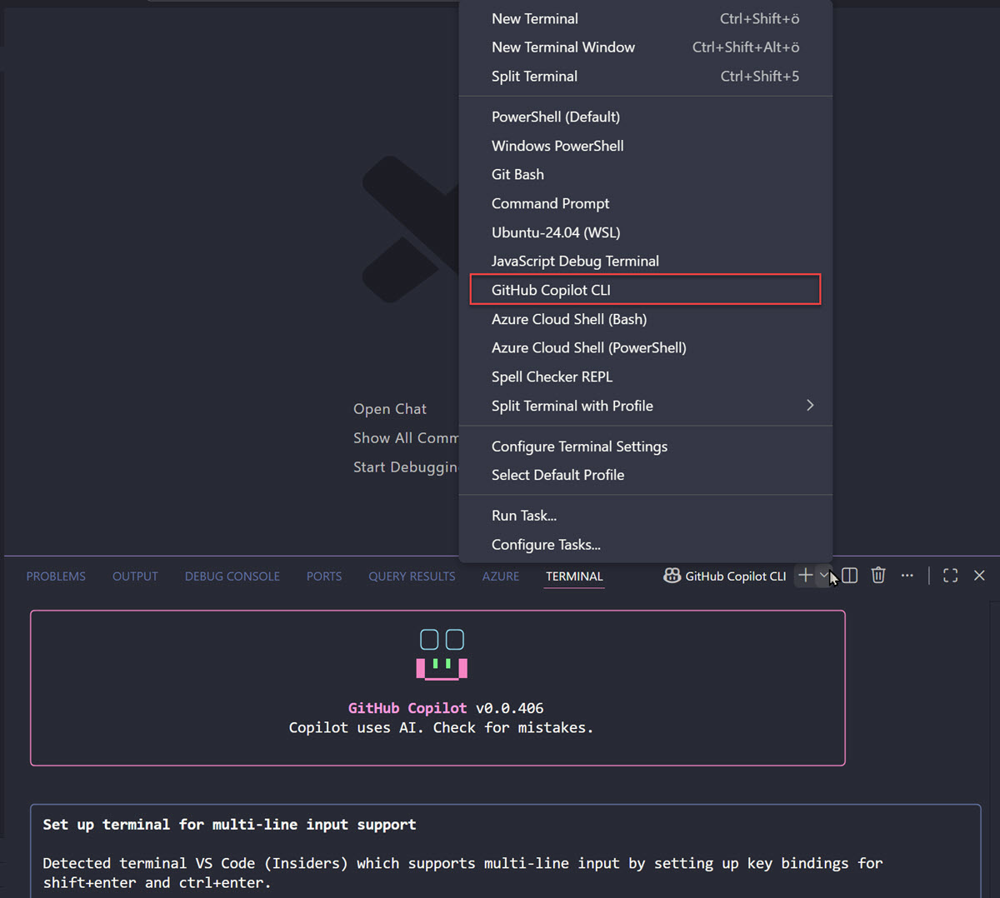

# GitHub Copilot CLI

GitHub Copilot CLI brings AI-powered code assistance directly to your terminal and command-line workflows. It provides intelligent suggestions for commands, scripts, and operations without leaving your development environment. This streamlines repetitive tasks and accelerates development cycles across any shell environment.

## Use Cases & Benefits

- Codebase maintenance: Tackle security-related fixes, dependency upgrades, and targeted refactoring without manual effort.
- Feature development: Implement incremental feature requests and new functionality with AI-assisted code generation.
- Documentation: Update and create project documentation automatically based on your codebase.
- Test coverage: Develop additional test suites to improve code quality and maintainability.
- Prototyping: Greenfield new projects and concepts quickly without starting from scratch.
- Environment setup: Run terminal commands to set up your local development environment for existing projects.
- Command discovery: Find the right command to perform tasks or get natural language explanations of unfamiliar commands.



> Note: Copilot can also be used in the VS Code terminal for an integrated development experience without context switching.

## Installation

Supported on Linux, macOS, and Windows (PowerShell v6 or higher on Windows).

Install with WinGet (Windows):

```bash
winget install GitHub.Copilot
```

Install with npm (macOS, Linux, and Windows):

```bash
npm install -g @github/copilot
```

On first launch, run `copilot` and use the `/login` slash command to authenticate with your GitHub account.

## Base Commands

GitHub Copilot CLI uses slash commands for core functionality:

- `/login`: Authenticate with your GitHub account or use a Personal Access Token
- `/model`: Switch between available models (Claude Sonnet 4.5, Claude Sonnet 4, GPT-5)
- `/experimental`: Enable experimental features like Autopilot mode
- `/lsp`: View Language Server Protocol configuration and status
- `/feedback`: Submit confidential feedback about your experience

Press `Shift+Tab` to cycle through modes including Autopilot, which encourages the agent to continue working until a task completes.

For comprehensive documentation and usage examples, see [GitHub Copilot CLI](https://github.com/github/copilot-cli) and the [official documentation](https://docs.github.com/copilot/concepts/agents/about-copilot-cli).